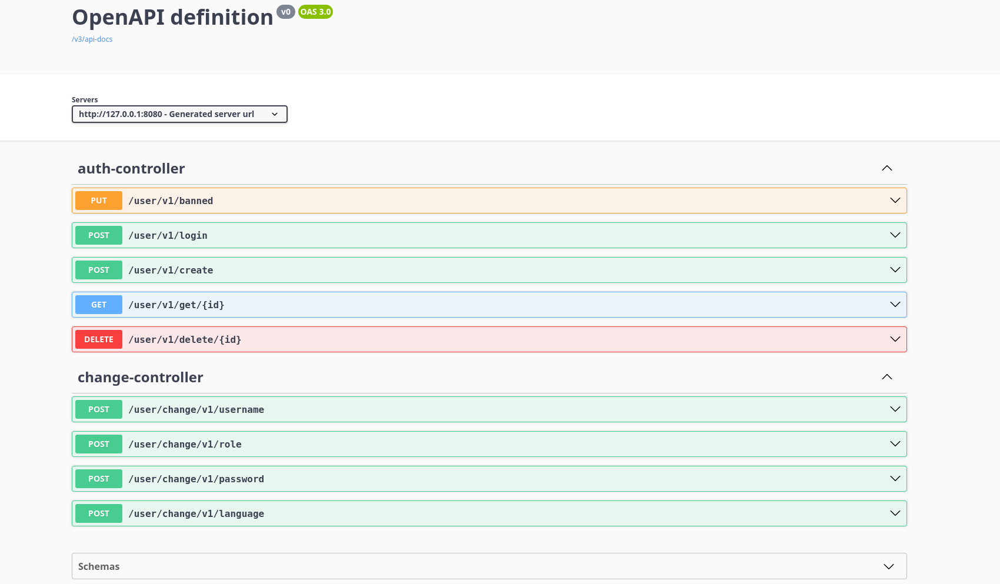

<h1> Como rodar esse projeto ?</h1>

Computador 💻

Clone por HTTPS ou SSH ⤵️

    HTTPS = https://github.com/eulerBM/SentinelAuth.git

    SSH = git@github.com:eulerBM/SentinelAuth.git

Abrir o Projeto

    Abra o projeto usando sua IDE favorita, recomendamos o IntelliJ IDEA para uma melhor experiência de desenvolvimento.

Atualizar Dependências do Maven

    Na sua IDE, clique no ícone do Maven para abrir a janela de comandos do Maven. Em seguida, clique no botão "Reload" (ou "Atualizar") para garantir que todas as dependências do projeto sejam baixadas e atualizadas corretamente.

Executar o Projeto

    Após atualizar as dependências, execute o projeto. Você pode fazer isso diretamente na sua IDE, procurando e executando a classe principal do aplicativo ou usando os comandos fornecidos pela IDE.

